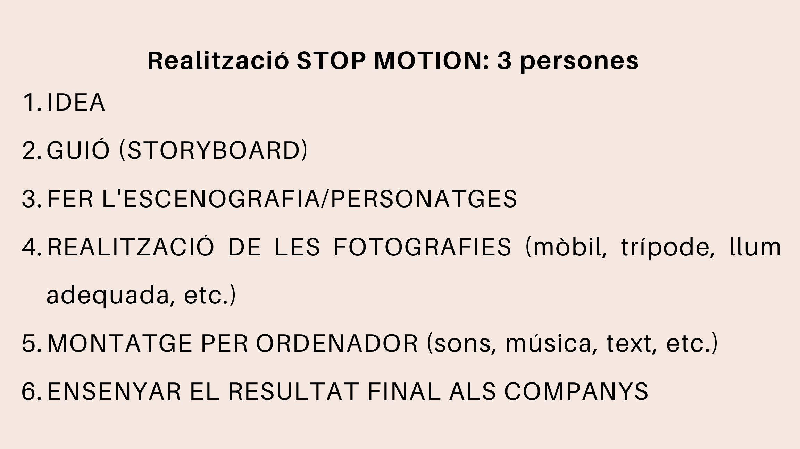

# Activitat de classe

En grups de **3 persones**, haureu de crear una animació breu utilitzant la tècnica de **stop motion**.

## Passos de treball

1. Pensar la idea.
2. Escriure el guió o storyline.
3. Fer l'storyboard.
4. Construir l'escenografia i els personatges.
5. Realitzar les fotografies amb mòbil, trípode i llum adequada.
6. Fer el muntatge per ordinador.
7. Afegir sons, música o text si és necessari.
8. Mostrar el resultat final als companys.

!!! tip "Consell de rodatge"
    Feu moviments molt xicotets entre una fotografia i la següent. Si el canvi és massa gran, el moviment no semblarà natural.

??? question "Quantes fotos necessitem?"
    Si voleu fer 10 segons de vídeo a 12 fps, necessitareu aproximadament 120 fotografies.

## Storyboard

| Vinyeta | Què passa? | Pla o enquadre | So o text |
|---:|---|---|---|
| 1 | Presentació del personatge | Pla general | Música inicial |
| 2 | Apareix el problema | Pla mitjà | Efecte de sorpresa |
| 3 | El personatge actua | Pla detall | So d'acció |
| 4 | Resolució final | Pla general | Crèdits finals |

## Materials possibles

- Plastilina.
- Cartolines.
- Caixes de sabates.
- Joguets.
- Peces de construcció.
- Telèfon mòbil.
- Trípode o suport estable.
