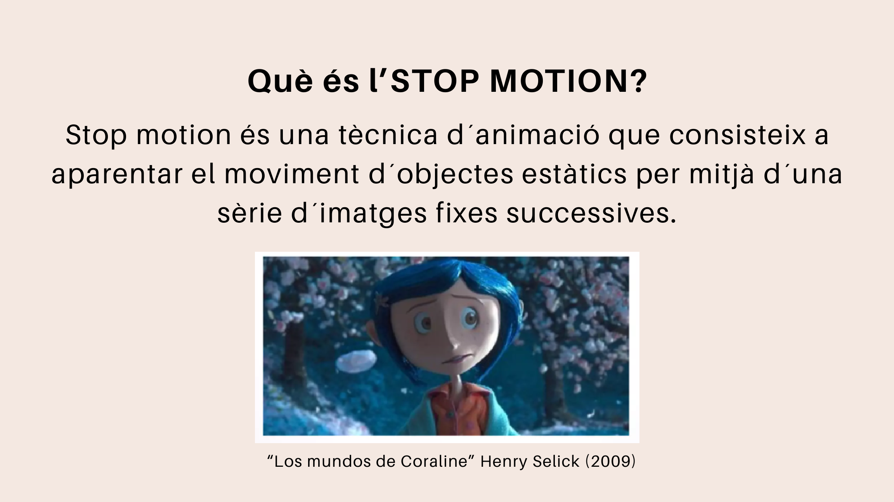
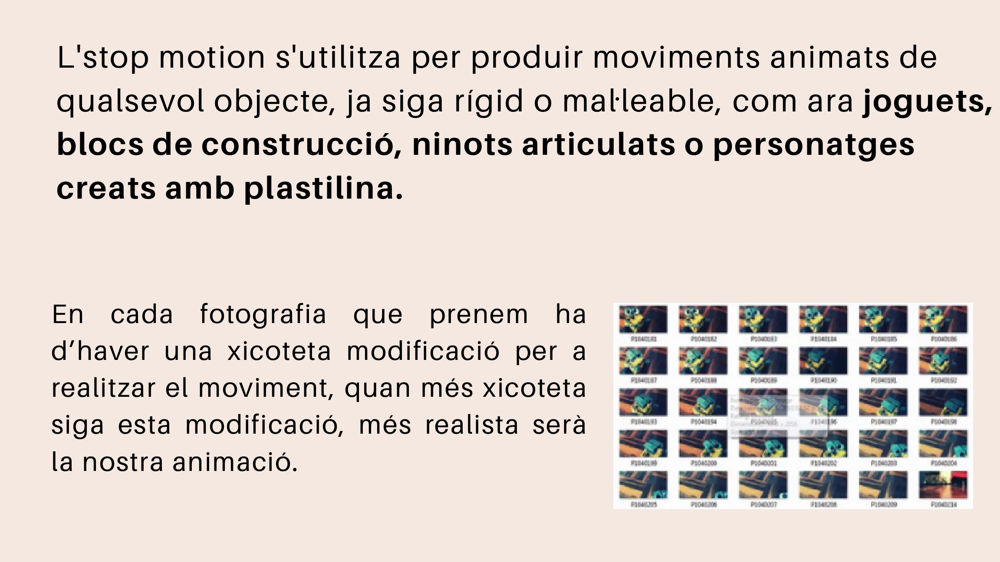
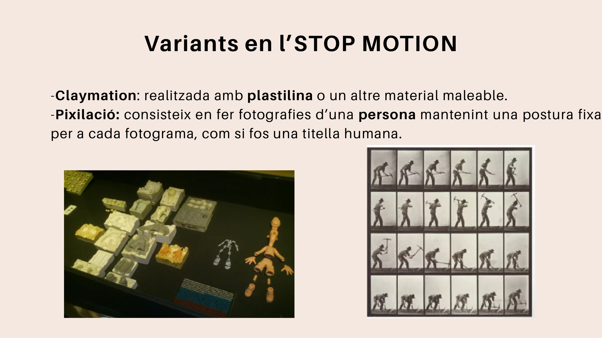
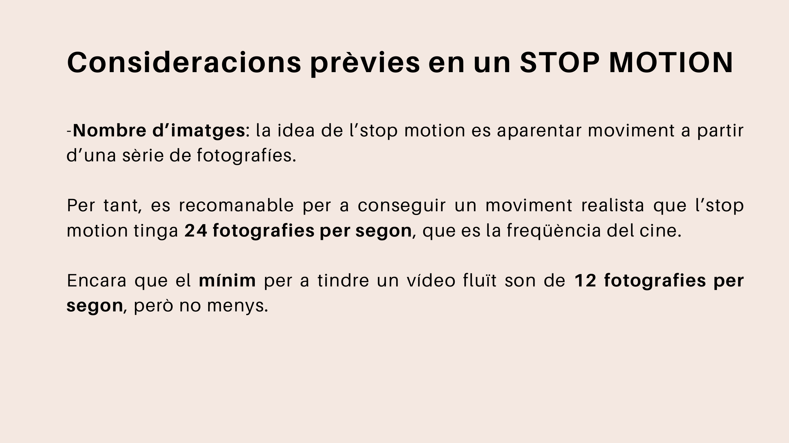

# Què és l'stop motion?

L'**stop motion** és una tècnica d'animació que consisteix a aparentar el moviment d'objectes estàtics mitjançant una sèrie d'imatges fixes successives.

{ width="78%" }

!!! note "Idea principal"
    La càmera no grava el moviment directament. El moviment es crea unint moltes fotografies on l'objecte canvia molt poc de posició.

En cada fotografia ha d'haver una xicoteta modificació. Com més menut siga el canvi entre una fotografia i la següent, més fluida serà l'animació.

## Materials que podem animar

Podem utilitzar materials molt senzills:

- plastilina;
- joguets;
- blocs de construcció;
- ninots articulats;
- paper o cartolina;
- objectes quotidians.

{ width="78%" }

## Variants

### Claymation

La **claymation** és una animació feta amb plastilina o altres materials mal·leables.

### Pixilació

La **pixilació** consisteix a fotografiar persones mantenint una postura fixa en cada fotograma, com si foren titelles humanes.

{ width="78%" }

??? warning "Compte amb els canvis bruscos"
    Si l'objecte es mou massa entre una fotografia i la següent, l'animació quedarà tallada i poc natural.

## Nombre d'imatges

| Fotografies per segon | Resultat aproximat |
|---:|---|
| 6 fps | Moviment molt tallat |
| 12 fps | Moviment acceptable per a una activitat escolar |
| 24 fps | Moviment més realista |

{ width="70%" }
