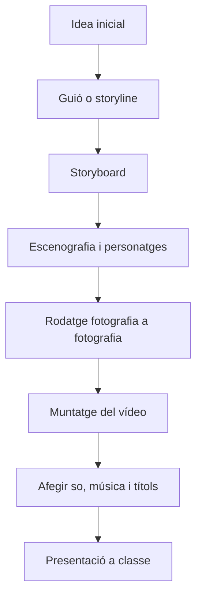
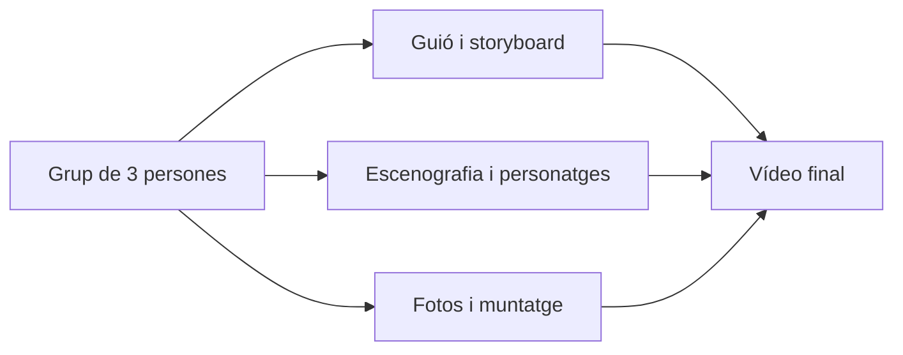

# Diagrama del projecte

Aquest diagrama mostra el flux de treball que seguirà l'alumnat per crear una animació amb stop motion.

!!! example "Lectura del diagrama"
    El procés comença amb una idea senzilla i acaba amb la presentació del vídeo final davant dels companys.

## Diagrama de responsabilitats del grup

