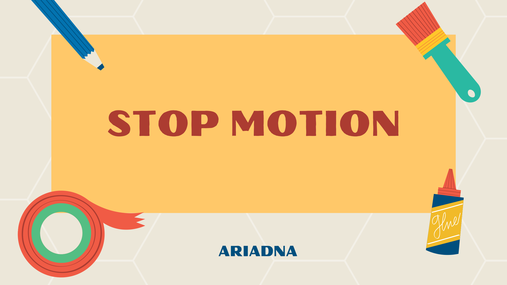

# Apunts de Stop Motion

Aquest lloc web recull uns apunts bàsics sobre la tècnica d'animació **stop motion**, preparats amb **MkDocs Material**.

[Baixa el PDF dels apunts](pdf/apunts_stop_motion_material.pdf){ .md-button .md-button--primary }
[Consulta l'activitat](activitat.md){ .md-button }

{ width="80%" }

!!! info "Què s'ha configurat en aquesta unitat"
    Aquest web utilitza el tema **Material**, búsqueda interna, panells de navegació, canvi entre tema clar i fosc, admonitions, codi amb numeració, diagrames Mermaid i accés a PDF.

???+ tip "Com navegar pel web"
    Pots utilitzar el menú superior, el panell lateral i la caixa de búsqueda per trobar ràpidament els apartats del recurs.

## Contingut principal

- [Què és l'stop motion?](apunts.md)
- [Fases del procés](proces.md)
- [Diagrama del projecte](diagrama.md)
- [Activitat per a l'alumnat](activitat.md)
- [Rúbrica d'avaluació](avaluacio.md)
- [Recursos i descàrrega del PDF](recursos.md)
