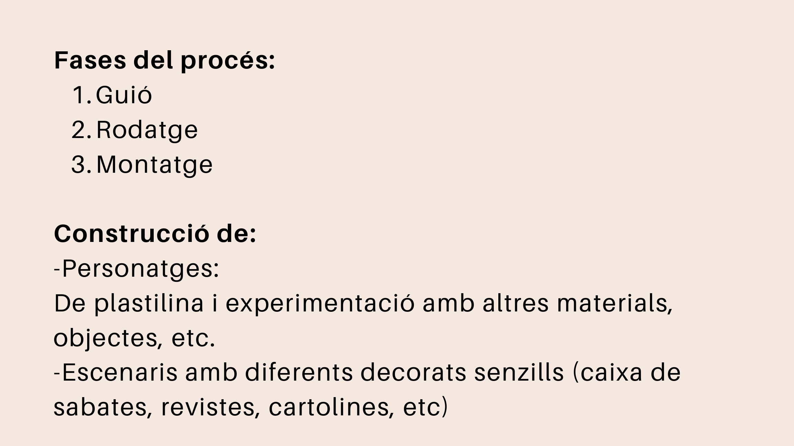
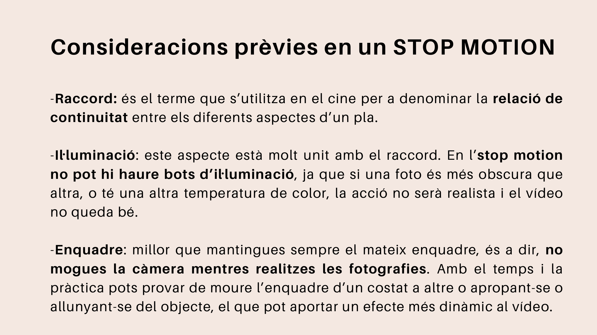

# Procés de treball

Un projecte de stop motion es pot organitzar en tres grans fases:

1. **Guió**
2. **Rodatge**
3. **Muntatge**

{ width="72%" }

## Raccord, llum i enquadre

Perquè l'animació quede bé, cal controlar la continuïtat visual.

!!! abstract "Aspectes tècnics importants"
    - **Raccord:** continuïtat entre fotografies.
    - **Il·luminació:** la llum ha de ser estable.
    - **Enquadre:** la càmera no s'ha de moure.

{ width="78%" }

## Exemple de configuració del projecte

El fragment següent mostra una possible configuració de `mkdocs.yml` per activar el tema Material, la búsqueda, les extensions de codi i els diagrames Mermaid.

```yaml linenums="1" title="mkdocs.yml"
site_name: Apunts de Stop Motion
theme:
  name: material
  features:
    - navigation.sections
    - navigation.top
    - search.highlight
    - content.code.copy
  palette:
    - scheme: default
      toggle:
        icon: material/brightness-7
        name: Canvia a mode fosc
    - scheme: slate
      toggle:
        icon: material/brightness-4
        name: Canvia a mode clar
plugins:
  - search
  - page-to-pdf
markdown_extensions:
  - admonition
  - pymdownx.details
  - pymdownx.highlight:
      linenums: true
  - pymdownx.superfences
```

???+ success "Per què és útil aquesta configuració?"
    Amb aquesta configuració, el web té navegación clara, búsqueda interna, codi amb botó de còpia i possibilitat de generar PDF.
